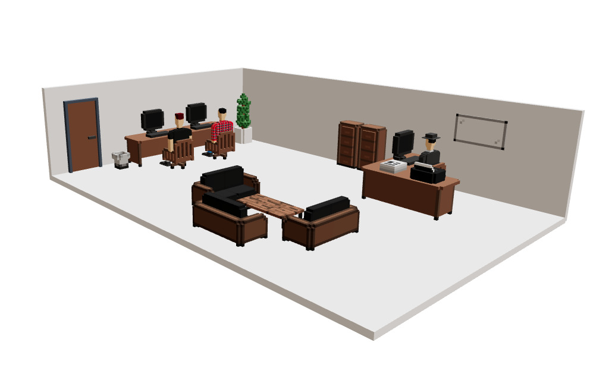
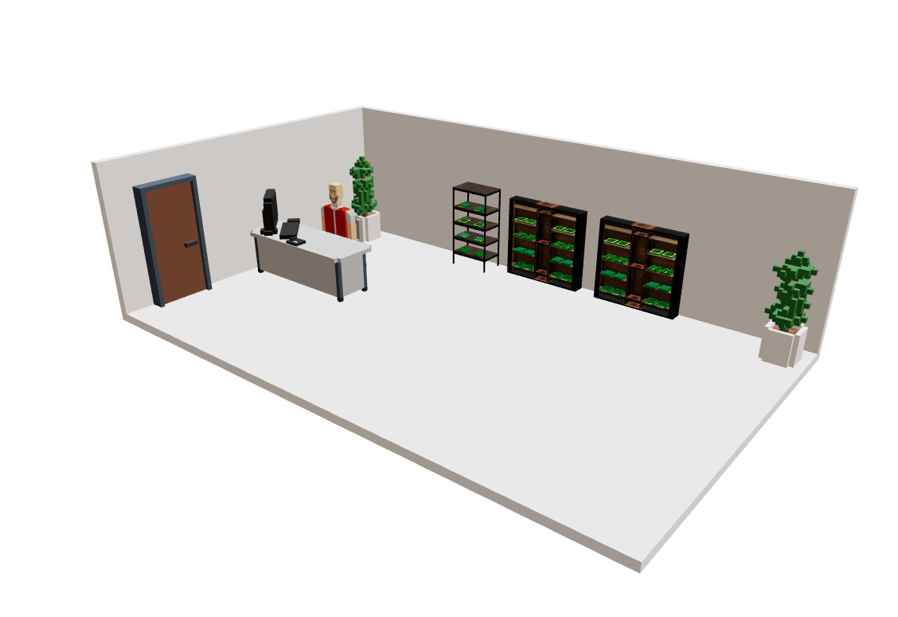

[_metadata_:author]:- "Andrija Milovac, Roko Burilo"
[_metadata_:title]:- "Dave the Computer Guy"

# Dave the Computer Guy

## Table of contents
1. [Simple explanation](#simple-explanation)
2. [Story intro](story-intro)
3. [Graphics](#graphics)
    a. [Office](#office)
    b. [Home](#home)
    c. [Electronics shop](#shop)
4. [Gameplay](#gameplay)
5. [Product market](#product-market)
6. [Product implementation](#product-impl)

## Simple explanation
[simple-explanation]: #simple-explanation
"Dave the Computer Guy" is a WebGL game with the goal of teaching you how to build a computer from scratch out of logic gates step by step.

## Story intro
[story-intro]: #story-intro
You are in control of Dave, a fresh out-of-college computer science graduate. After he graduated, he was hired by a local electronics manufacturer called "Electro Nick's".

He works in the company's office with his assigned mentor and senior hardware developer John Dodi and their boss Dexter Crawford.

Dave's day to day will consist of syncing with his boss about the work that needs to be done and doing the required work which is mostly creating new electronic components and manufacturing them.

Whenever Dave gets stuck on a task or has no idea where to even start he can always ask John Dodi for help as he is a senior developer with decades of experience and wisdom.

The reason he wants to do this is that he was originally a software engineer and only recently dived into the world of hardware and he wishes to connect his software knowledge with his newly found hardware knowledge so that he can have a deep understanding of computers.

## Graphics
[graphics]: #graphics
The game will use WebGL to display its graphics. The graphics are 3D and voxel models will be used. An isometric camera will be used to view the scenes.

There will be 3 main scenes in which the player will play. Each of the mentioned 3D scenes will contain clickable elements that will open additional UI elements where the gameplay will actually happen (e.g. the circuit editor window).

The rooms can be viewed down below:

### The office - Dave's workplace
[office]: #office
{width=50%}

### Home - Dave's place of rest and personal hobbies
[home]: #home
{width=50%}

### Electronics shop - Dave's go-to shop for electronics components
[shop]: #shop
{width=50%}

## Gameplay
[gameplay]: #gameplay
The goal of the game is too build your own computer at home that can execute instructions of a predefined format (we made the instructions predefined so that we can validate the validity of the made computer by executing predefined programs).

The game will follow a linear path which is of the following form:
- Get an assignment from your boss.
- Solve the assignment. (This includes producing various components and buying the necessary parts to make the components)
- Get paid for solving the assignment and unlock new components.
- Use the knowledge you've acquired and your money to advance your computer during your free-time at home.
- Once you progressed and unlocked every type of component you will get the final mission of building a computer.
- Once you build a computer that satisfies the given conditions (checked via tests made by the developers) you have officially completed the main story of the game.

## Product market
[product-market]: #product-market
The audience for this product are electronics and computer enthusiasts as well as college students. The product could be used by universities to teach computer architecture in a fun way engaging and rewarding way. Profit will be earned by leveraging the game economy and reward ads. (Up to disscussion, detailed description needed).

## Product implementation
[product-impl]: #product-impl
The core simulator will be written in Rust (compiled into wasm) or in TypeScript.

The frontend will be made using the following technologies:
- Svelte (with SvelteKit as the application framework) as the frontend framework
- Threlte as the WebGL framework (A declarative way of using Three.js)
- TailwindCSS for styling
- Google AdSense ads

The backend will be made using the following technologies:
- Vert.x as the backend web framework/toolkit
- MongoDB as the database

The application will be hosted on a Virtual Private Server (VPS).
